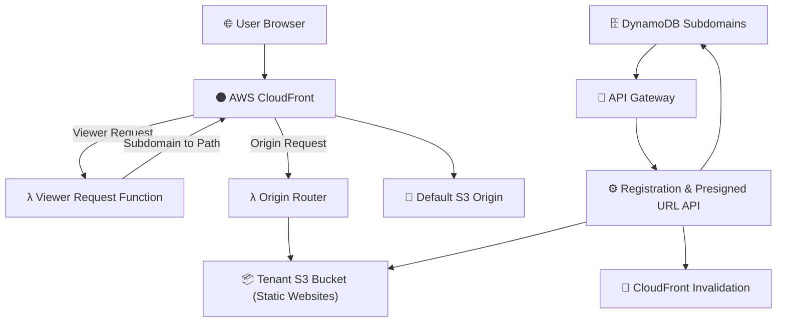

# 🎮 WorldBuilder: Create and Host Phaser.js Games with AI Assistance

<div align="center">
  
  <p><strong>Build browser games with AI, deploy instantly.</strong></p>
</div>


WorldBuilder is a specialized platform that simplifies browser-based game development using Phaser.js(iteration 1) and AI assistance. Create, deploy, and share games with minimal coding knowledge through our streamlined multi-tenant architecture.

## 🌟 Overview

WorldBuilder allows anyone to:
- **Describe** your game idea in plain language
- **Generate** code and game design documents using AI
- **Customize** your game in an integrated development environment
- **Deploy** instantly to your personal subdomain (yourname.app.worldbuilder.space)
- **Share** your creation with others

## 📚 Table of Contents

- [✨ Key Features](#-key-features)
- [🏗️ Architecture Overview](#️-architecture-overview)
- [🚀 Getting Started](#-getting-started)
  - [Prerequisites](#prerequisites)
  - [Installation](#installation)
  - [Running Locally](#running-locally)
- [🛠️ Deployment Guide](#️-deployment-guide)
- [🧩 Technical Details](#-technical-details)
- [🔒 Security Considerations](#-security-considerations)
- [👥 Who Is This For?](#-who-is-this-for)
- [📜 Roadmap](#-roadmap)
- [🤝 Contributing](#-contributing)
- [📝 License](#-license)

## ✨ Key Features

### 🎨 Simplified Game Development
- **AI Game Assistant**: Describe your game idea in plain language - our AI creates the code
- **Game Design Document Generation**: Auto-generate detailed GDDs to guide your development
- **Minimal Coding Required**: Focus on game design while AI handles implementation details
- **Real-time Preview**: See your changes instantly as you develop

### 🚀 Dedicated Hosting Solution
- **Instant Deployment**: One-click publishing to your own subdomain (yourname.app.worldbuilder.space)
- **Zero Configuration**: No need to set up servers or hosting infrastructure
- **Reliable Infrastructure**: Built on AWS CloudFront, Lambda@Edge, and S3
- **Efficient Asset Handling**: Upload game assets directly to your project

### 🛠️ Streamlined Workflow
- **All-in-One Interface**: Code editor, design document, and preview in a single workspace
- **Version Control**: Track changes to your game over time
- **Export Options**: Download your game code or design documents
- **Interactive Tutorials**: Learn as you build with guided creation flows

## 🏗️ Architecture Overview

WorldBuilder uses a multi-tenant architecture powered by AWS services:



## 🚀 Getting Started

### Prerequisites

- Node.js 16+ and npm
- AWS account (for deployment features)
- AWS CLI installed and configured (for deployment)
- Git

### Installation

1. **Clone the repository**
```bash
git clone https://github.com/your-org/worldbuilder.git
cd worldbuilder
```

2. **Install dependencies**
```bash
npm install
```

3. **Set up environment variables**
```bash
# Copy example environment file
cp dev.env .env.local

# Edit .env.local with your settings
# Required for AI features:
# - ANTHROPIC_API_KEY=your_api_key
# Required for deployment features:
# - AWS_ACCESS_KEY_ID=your_access_key
# - AWS_SECRET_ACCESS_KEY=your_secret_key
# - AWS_REGION=us-west-2
```

### Running Locally

1. **Start the development server**
```bash
npm run dev
```

2. **Access the application**
Open [http://localhost:3000](http://localhost:3000) in your browser.

3. **Creating your first game**
   - Click "New Project" 
   - Choose a Phaser.js template
   - Describe your game idea in the AI assistant
   - Customize the generated code
   - Test in the preview panel

## 🛠️ Deployment Guide

### Prerequisites
- AWS account with Administrator access
- AWS CLI installed and configured
- Domain registered (e.g., `worldbuilder.space`)
- Basic understanding of bash scripting

### Deployment Steps

1. **Set up CloudFront Distribution**

```bash
./deploy/prod/setup-cloudfront.sh
```

2. **Deploy Lambda@Edge Routing**

```bash
./deploy/prod/setup-lambda-edge.sh
```

3. **Deploy Registration API**

```bash
./deploy/prod/setup-register-api.sh
```

4. **Configure DNS (Route53)**

Point domain/subdomains to CloudFront distribution:

| Record type | Hostname                   | Points to         |
|-------------|----------------------------|-------------------|
| A or CNAME  | `app.worldbuilder.space`   | CloudFront Domain |
| CNAME       | `*.app.worldbuilder.space` | CloudFront Domain |

### Usage Examples

#### Creating a New Space

```bash
./deploy/prod/create-space.sh <subdomain> "<html_content>" [user_id]

# Example:
./deploy/prod/create-space.sh adventure '<h1>My Adventure</h1>' user42
```

#### Updating Content

```bash
./deploy/prod/update-content.sh <subdomain> <path> <file> [user_id]

# Example:
./deploy/prod/update-content.sh adventure index.html ./new-adventure.html user42
```

#### Uploading Multiple Files

```bash
./deploy/prod/upload-files.sh <subdomain> <user_id> <file1> [file2] [file3] ...

# Example:
./deploy/prod/upload-files.sh adventure user42 index.html style.css game.js
```

## 🧩 Technical Details

### Project Structure

```
worldbuilder/
├── deploy/                   # Deployment scripts and AWS configuration
│   ├── lambda/               # Lambda function source code
│   └── prod/                 # Production deployment scripts
├── src/
│   ├── app/                  # Next.js app router components
│   ├── components/           # React components
│   │   ├── Assets/           # Asset management UI
│   │   ├── Chat/             # AI chat interface
│   │   ├── Editor/           # Code editor components
│   │   ├── GameDesign/       # Game design document UI
│   │   ├── Preview/          # Game preview components
│   │   └── ui/               # Reusable UI components
│   ├── contexts/             # React context providers
│   ├── data/                 # Static data and templates
│   ├── hooks/                # Custom React hooks
│   ├── pages/                # Next.js page components and API routes
│   ├── styles/               # CSS modules and global styles
│   ├── templates/            # Game template files
│   ├── types/                # TypeScript type definitions
│   └── utils/                # Utility functions
└── public/                   # Static assets
```

### Technologies Used

#### Frontend
- **Framework**: Next.js & React
- **Editor**: Monaco Editor (VS Code-like editor)
- **Game Engine**: Phaser.js (version 3.55+)
- **AI Integration**: Anthropic Claude API
- **Styling**: CSS Modules & Tailwind CSS

#### Backend & Infrastructure
- **AWS CloudFront**: Content delivery and routing
- **AWS Lambda@Edge**: Dynamic routing based on subdomains
- **AWS S3**: Game hosting and asset storage
- **AWS API Gateway**: API endpoints for game management
- **AWS DynamoDB**: Subdomain and user data storage

## 🔒 Security Considerations

- Implement AWS Cognito for user authentication
- Use AWS WAF to protect API endpoints
- Regularly review IAM roles and policies
- Enable AWS CloudTrail for audit logging
- Set presigned URL expiration to minimum required duration

## 👥 Who Is This For?

- **Beginner Game Developers**: Create games without extensive programming knowledge
- **Game Design Students**: Learn game development concepts with immediate results
- **Educators**: Create interactive educational games for teaching
- **Game Jam Participants**: Rapidly prototype and publish game ideas
- **Hobbyists**: Bring your game ideas to life without technical barriers

## 📜 Roadmap

### Current Focus
- Single-player Phaser.js Games
- Beginner-Friendly Experience
- Streamlined Hosting

### Coming Soon
- Multiplayer Support
- Discord Integration
- Enhanced Templates
- Community Features

## 🤝 Contributing

We welcome contributions! Here's how you can help:

1. Fork the repository
2. Create a feature branch: `git checkout -b amazing-feature`
3. Commit your changes: `git commit -m 'Add amazing feature'`
4. Push to the branch: `git push origin amazing-feature`
5. Open a Pull Request
---

<div align="center">Created with ❤️ for WorldBuilder</div>