# 🚀 **WorldBuilder Platform: Enhanced Deployment Guide**

Welcome to **WorldBuilder**, a powerful multi-tenant platform that enables users to create, manage, and deploy custom static websites on personalized subdomains using AWS infrastructure. This guide details everything you need to deploy, operate, and maintain WorldBuilder effectively.

---

## 🌟 **Overview**

WorldBuilder allows easy creation and management of user-specific web spaces hosted securely on AWS, leveraging a serverless architecture to ensure scalability, reliability, and ease of use.

---

## 📐 **Architecture Overview**

[Architecture Diagram click here](https://mermaid.live/view#pako:eNplUs1q20AQfpVhDyWB5NSbA4XYwiYQiLGSGGLlMJYm8hJr113Nxpg4h0COgRZaKO3FPfUZWvoOfYi-QPMI3dVaikJuM_P9zM_urUh1RqIjcoOLGZxGB4kC6Bq9LMlMnjaPH-HMRXXlEvb330Gv75DNdzgcx9Cba5v1jVZ86ZW9fsVYn0taOtmI3lsqeQ0hP8ZimuHkz294iUPfqpSlVpVHmxvcYjvNdIFSAWsYIs_WrlG73YmRuUObdiF_blfj2rJbwivbjMojfntKChVPEvG0-fQDQubK0LXpNTHsxIwsUxjTtJRM5W4i2itHdIV2zsE3mNzXRe8SgK0mWiksdNR1d_zy8O_nh6YAzapluPXh8GgwdrTPv3wIA2Ra4qoyqaCKFNZw-eTvt6_ebkS5LNmgvym8gaGhUuaKMjgbHXtdpW9UYf7tBK-R-jKvkefHP1I3OJeZm87P-tBCoIH8-4o9UZBx-2Xuz916x0TwjApKRMeFGZrrRCTqzvHQso5XKhUdNpb2hNE2n4nOFc5Ll9mFbxZJdB-3qCkLVBdaF1vS3X9VOgQO)

```mermaid
graph TD;
  Browser[🌐 User Browser] --> CF[🟠 AWS CloudFront]
  CF --> |Viewer Request| ViewerLambda[λ Viewer Request Function]
  ViewerLambda --> |Subdomain to Path| CF
  CF --> |Origin Request| OriginLambda[λ Origin Router]
  OriginLambda --> S3Tenant["📦 Tenant S3 Bucket (Static Websites)"]
  CF --> DefaultOrigin["📁 Default S3 Origin"]
  DynamoDB[🗄️ DynamoDB Subdomains] --> APIGW[🔹 API Gateway]
  APIGW --> LambdaAPI[⚙️ Registration & Presigned URL API]
  LambdaAPI --> DynamoDB
  LambdaAPI --> S3Tenant
  LambdaAPI --> CloudFrontInvalidate[🔄 CloudFront Invalidation]
```



**Key Components:**

| Component                | Description                                  |
|--------------------------|----------------------------------------------|
| 🌐 User Browser          | End-user client accessing websites           |
| 🟠 AWS CloudFront        | CDN for low-latency global delivery          |
| 📦 Tenant S3 Bucket      | Individual bucket per tenant                 |
| 🗄️ DynamoDB              | Stores tenant subdomain/user metadata        |
| ⚙️ Registration API      | Handles registration, file uploads, metadata |
| λ Lambda@Edge Functions  | Dynamic routing and rewriting logic          |

---

## 🛠️ **Prerequisites**

- ✅ AWS account with Administrator access
- ✅ AWS CLI installed (`aws configure` set up)
- ✅ Domain registered (e.g., `worldbuilder.space`)
- ✅ Familiarity with Bash terminal environment

---

## 🌐 **Deployment Steps**

Follow these steps to fully deploy WorldBuilder:

### **1️⃣ Set up CloudFront Distribution**

Creates CDN distribution and default origin bucket.

```bash
./deploy/prod/setup-cloudfront.sh
```

- Outputs distribution ID & URL.

### **2️⃣ Deploy Lambda@Edge Routing**

Deploy dynamic routing functions to AWS Lambda@Edge.

```bash
./deploy/prod/setup-lambda-edge.sh
```

- Sets IAM roles and Lambda functions for viewer and origin requests.

### **3️⃣ Deploy Registration API**

Deploy backend API (Lambda + DynamoDB + API Gateway).

```bash
./deploy/prod/setup-register-api.sh
```

- Creates necessary DynamoDB table (`worldbuilder-subdomains`).
- Configures API Gateway endpoints.

### **4️⃣ Configure DNS (Route53)** *(Manual step)*

Point domain/subdomains to CloudFront distribution:

| Record type | Hostname                      | Points to                  |
|-------------|-------------------------------|----------------------------|
| A or CNAME  | `app.worldbuilder.space`      | CloudFront Domain          |
| CNAME       | `*.app.worldbuilder.space`    | CloudFront Domain          |

---

## 🚀 **Operational Guide**

Common operational tasks clearly explained.

### 🆕 **Create a New Space**

```bash
./deploy/prod/create-space.sh <subdomain> "<html_content>" [user_id]

# Example:
./deploy/prod/create-space.sh adventure '<h1>My Adventure</h1>' user42
```

### 🔄 **Update Space Content**

```bash
./deploy/prod/update-content.sh <subdomain> <path> <file> [user_id]

# Example:
./deploy/prod/update-content.sh adventure index.html ./new-adventure.html user42
```

### 📦 **Upload Multiple Files (Presigned URLs)** *(Recommended)*

Improved secure direct uploads from user browser/device to S3 via presigned URLs:

**Client Requests Presigned URLs (Lambda API):**

```json
{
  "subdomain": "adventure",
  "userId": "user42",
  "files": [
    {"path": "index.html", "contentType": "text/html"},
    {"path": "scripts/main.js", "contentType": "application/javascript"}
  ]
}
```

**Lambda Response:**

```json
{
  "uploadUrls": [
    {
      "path": "index.html",
      "url": "https://s3-presigned-url"
    },
    {
      "path": "scripts/main.js",
      "url": "https://s3-presigned-url"
    }
  ]
}
```

**User uploads directly to S3** via provided URLs.

---

## 🧹 **Maintenance & Troubleshooting**

### 🔍 **Common Issues and Fixes**

| Issue                  | Cause                         | Solution                        |
|------------------------|-------------------------------|---------------------------------|
| ❌ 403 Error           | Ownership mismatch            | Use correct `user_id`           |
| 🔄 Cache Stale         | CloudFront caching            | Run `invalidate-cache.sh` script|
| 🗃️ DynamoDB Index Missing | Misconfigured table creation | Run `fix-dynamodb.sh` script    |
| 🚧 Permissions Error    | IAM Role insufficient        | Check and adjust IAM policies   |

### 📜 **View Logs**

**Lambda logs** (CloudWatch):

```bash
aws logs tail /aws/lambda/worldbuilder-register-subdomain --follow
```

**Lambda@Edge logs** (us-east-1):

```bash
aws logs tail /aws/lambda/us-east-1.worldbuilder-edge-router --region us-east-1 --follow
```

---

## 🔐 **Security Considerations**

Explicit recommendations to keep your system secure:

- ✅ Implement **AWS Cognito** for user authentication.
- ✅ Use **AWS WAF** to protect API endpoints.
- ✅ Regularly review IAM roles and policies.
- ✅ Enable AWS CloudTrail for audit logging.
- ✅ Set presigned URL expiration to minimum required duration (e.g., 1 hour).

---

## 🎛️ **Advanced Configuration**

### 🌎 **Custom Domains (SSL with ACM)**

1. Request SSL certificate in ACM (`us-east-1`).
2. Update CloudFront distribution with your SSL certificate.
3. Point DNS records to CloudFront domain.

### 🗃️ **Data Backup (DynamoDB)**

Periodic backups:

```bash
aws dynamodb export-table-to-point-in-time \
  --table-arn arn:aws:dynamodb:us-west-2:ACCOUNT:table/worldbuilder-subdomains \
  --s3-bucket backup-bucket \
  --s3-prefix dynamodb-backups/
```

---

## 💰 **Cost Optimization Tips**

| Service             | Strategy                                   |
|---------------------|--------------------------------------------|
| **CloudFront**      | Adjust caching behavior, invalidate selectively |
| **S3**              | Use lifecycle policies for infrequently accessed data |
| **Lambda**          | Monitor execution, optimize function memory |

---

## 📈 **Limits & Quotas**

- 🔸 Max subdomains per user: **10** *(adjustable)*
- 🔸 Lambda@Edge timeout: **5 sec**
- 🔸 S3 bucket name length: **63 chars**
- 🔸 CloudFront invalidation limit: **1000 paths/month** free-tier

---

## 🛟 **Support & Contributions**

For help, to report issues, or contribute, contact:

- 📧 **Email**: `support@worldbuilder.space`
- 🐛 **Bug Reports**: [WorldBuilder Issues Tracker](https://github.com/your-repo/issues)

---

## 🚩 **Conclusion**

WorldBuilder offers robust, scalable static hosting with advanced features including secure direct file uploads and dynamic routing. By following this guide, you'll set up and maintain a secure, cost-effective, and performant hosting environment. 🌟